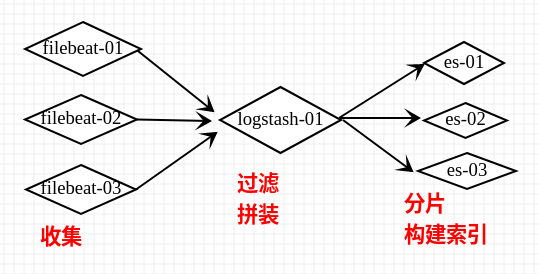

#### nginx的log_format与logstash的filter配置对应的例子


* nginx.conf
```
log_format  main  '$remote_addr - $remote_user [$time_local] "$request" '
                  '$status $body_bytes_sent "$http_referer" '
                  '"$http_user_agent"';

```

* logstash.conf
```
input {
    file { # 输入文件
        path => "/var/log/nginx/access/*.log"
        type => "logstash-nginx"
        start_position => "beginning"
    }
}

filter {
    if [type] == "logstash-nginx" {
        grok {
            match => {
                "message" => '%{IPORHOST:remote_addr} - %{USERNAME:user} \[%{HTTPDATE:time_local}\] "%{WORD:method} %{NOTSPACE:uri} HTTP/%{NUMBER:httpversion}" %{NUMBER:status} %{NUMBER:body_bytes_sent} "%{GREEDYDATA:http_referer}" "%{GREEDYDATA:http_user_agent}"'
            }
        }
        # date {
        #     match => [ "timestamp" , "dd/MMM/yyyy:HH:mm:ss Z" ]
        # }
        mutate {
            convert => [ "status", "integer" ]
            convert => [ "body_bytes_sent", "integer" ]
            remove_field => [ "path"]
        }
    }
}

output {
    if [type] == "logstash-nginx" {
        elasticsearch {
            hosts => ["http://elasticsearch:9200"]
            index => "logstash-nginx-%{+YYYY-MM-dd}"
            user => "elastic"
            password => "changeme"
        }
    }
    # 输出控制台
    # stdout { 
    #     codec => rubydebug
    # }
}
```


* nginx.conf
```
log_format  main  '$remote_addr - $remote_user [$time_local] "$request" '
                  '$status $body_bytes_sent "$http_referer" '
                  '"$http_user_agent" "$http_x_forwarded_for" '
                  '"$http_host" "$request_time" "$upstream_response_time" $http_device $http_appversion $upstream_addr '
                  '$http_openudid $http_code $http_networkType "$http_deviceModel" "$http_osVersion"';
```

* logstash.conf
```
input {
    file { # 输入文件
        path => "/var/log/nginx/access/*.log"
        type => "logstash-nginx"
        start_position => "beginning"
    }
}

filter {
    if [type] == "logstash-nginx" {
        grok {
            match => {
                "message" => "%{IPORHOST:Client_IP} (%{WORD:ident}|-) (%{USERNAME:auth}|-) \[%{HTTPDATE:timestamp}\] \"%{WORD:Http_Method} %{URIPATHPARAM:Http_Request} HTTP/%{NUMBER:Http_Version}\" %{NUMBER:Http_Status_Code} (?:%{NUMBER:Http_Bytes}|-) (?:\"(?:%{URI:Http_Referrer}|-)\"|%{QS:Http_Referrer}) %{QS:User_Agent} \"(%{QS:X_Forwarded_For}|-)\" \"(%{IPORHOST:Site}|-)\" \"(%{NUMBER:Request_Time}|-)\" \"(%{NUMBER:Upstream_Response_Time}|-)\" (%{WORD:Device}|-) (%{USERNAME:App_Version}|-) (%{HOSTNAME:Upstream_Host}:%{POSINT:Upstram_Port}|-) (%{WORD:Openudid}|-) (%{WORD:Usercode}|-) (%{WORD:NetType}|-) \"(%{GREEDYDATA:Device_Name}|-)\" \"(%{GREEDYDATA:System_Verion}|-)\""
            }
        }
        # date {
        #     match => [ "timestamp" , "dd/MMM/yyyy:HH:mm:ss Z" ]
        # }
        # mutate {
        #     convert => [ "[geoip][coordinates]", "float" ]
        #     convert => [ "Http_Status_Code", "integer" ]
        #     convert => [ "Http_Bytes", "integer" ]
        #     convert => [ "Request_Time", "float" ]
        #     convert => [ "Upstream_Response_Time", "float" ]
        #     # split => ["Http_Request", "?"]
        #     # add_field => { "Http_URI" => "%{Http_Request[0]}" }
        #     remove_field => [ "message", "beat", "@version", "auth", "prospector", "source", "offset"]
        # }
    }
}

output {
    if [type] == "logstash-nginx" {
        elasticsearch {
            hosts => ["http://elasticsearch:9200"]
            index => "logstash-nginx-%{+YYYY.MM.dd}"
            user => "elastic"
            password => "changeme"
        }
    }
    # 输出控制台
    # stdout { 
    #     codec => rubydebug
    # }
}
```